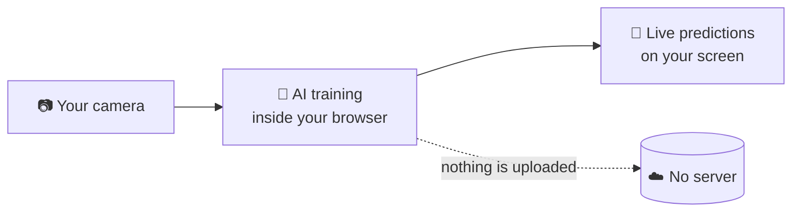
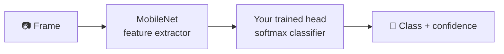

# TESR AI Vision Web Trainer

**Train your own image-recognition AI — right in your browser. Nothing to install.**

Open the page, show your objects to the camera, press Train, and watch the AI
recognize them live — with detection boxes and confidence scores. Everything runs
on **your own computer inside the browser**; your photos never leave your machine.

> 🎓 Built by [TESR — Thai Embedded Systems and Robotics](https://tesrshop.com)
> for makers, students and engineers. *Learn it. Build it. Deploy it. For real.*

---

## ✨ What it does

| | |
|---|---|
| 🧩 **Define classes** | Tell the AI what to tell apart — e.g. `remote` vs `powerbank` |
| 📷 **Collect examples** | Hold the capture button and move the object around, or upload image files |
| 🧠 **Train in seconds** | Transfer learning runs on your GPU via WebGL/WebGPU — typically under 10 seconds |
| 🎯 **Test live** | Two modes: **Classify** the whole frame, or **Detect** — boxes drawn around objects, each labeled with *your* classes |
| 💾 **Export** | Download your trained model (TensorFlow.js format) to use in your own web projects |

## 🔒 Privacy by design

There is **no backend**. The page is static — all computation (feature extraction,
training, inference) happens in your browser tab using [TensorFlow.js](https://www.tensorflow.org/js).
Close the tab and everything is gone, except the model you chose to download.

## 🚀 Try it

1. Open the page *(enable GitHub Pages on this repo: Settings → Pages → branch `main`, folder `/ (root)` — the URL will be `https://<your-name>.github.io/<repo>/`)*
2. The page checks your device first and tells you honestly whether it can train:
   - 🟢 GPU acceleration found (WebGL/WebGPU) — trains comfortably
   - 🟡 CPU only — works, keep datasets small
   - 🔴 Unsupported browser — it will tell you what to use instead
3. Add **at least 2 classes** → collect **30–50 examples each** → **Train** → point the camera and enjoy

**Tips for good results:** vary the angle, distance, background and lighting while
capturing. Add a "background / none" class so the AI knows what *nothing* looks like.

## 🖥 Requirements

- A recent **Chrome, Edge or Firefox** on a laptop/desktop (works on many phones too)
- A webcam (or use file upload instead)
- Internet connection on first load only (libraries ~10 MB, cached afterwards)

## 🧠 How it works (for the curious)

The page loads **MobileNet**, a pre-trained vision network, and uses it as a
feature extractor. Your examples are converted to compact feature vectors, and a
small neural network head is trained on top of them — that's why training takes
seconds, not hours. In **Detect** mode, **COCO-SSD** (also in-browser) proposes
bounding boxes around objects, and your freshly trained classifier names each box.

## 📚 Learn more with TESR Academy

This project is part of TESR's hands-on AI education:
**AI Vision Engineering for Edge AI** — Build, Train & Deploy AI to Edge Devices.
Follow us for workshops, courses and real deployment projects.

## License

MIT © TESR — Thai Embedded Systems and Robotics
